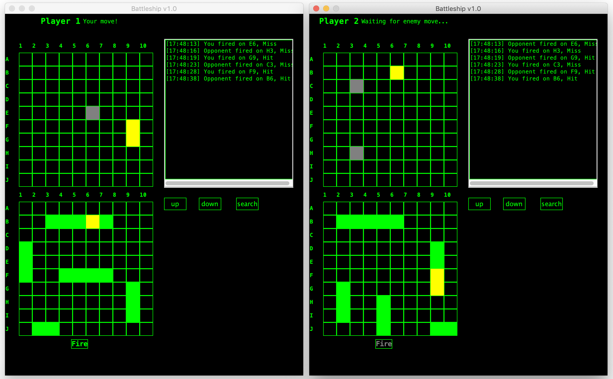

# Networked Battleship
This networked battleship project was a grade 12 final summative assignment built by [Jeevan O](https://github.com/jeevano), [Shivam S](https://github.com/ShivamSood17), and Luvish S. The project was built using Java and focused on the application of object oriented principles.
The program implements the ServerSocket and Socket classes from the java.net library to establish a  connection between two players located on the same network.
Communication between the server and client is handled using a separate thread in order to ensure that user can continue to interact with the game interface.

## Demo

## Original readme.txt
~~~~~~~~~~~~~~~~~    ----------------------------------     ~~~~~~~~~~~~~~~~~ 

          _~                     Battle Ship                           _~
    _~ )_)_~               By: Shivam, Jeevan, Luvish            _~ (_(_~
    )_))_))_)     - -o      Date: January 20th 2020              (_((_((_(
    _!__!__!_                    Version: 1.0               \    _!__!__!_
~~~ \______t/ ~~~~                                          ~o~~ \t______/ ~~
  ~~~ ~ ~~~~~~ ~~    ----------------------------------         ~~~ ~ ~~~ ~~

~~~~~~~~~~~~~~~~~~~~~ Battle Ship Program Instructions ~~~~~~~~~~~~~~~~~~~~~~
- Run the Battleship jar file and choose between single player, creating a
  server, joining a server, and help. The single player button will take you
  directly to play against the AI and help will teach you how to play. To run
  a multiplayer game first create a server by entering a valid port (1024 to
  9999) and then using the connect to server button join the game. On another
  computer, located on the same network, click the connect to server button to
  play a two player game of battleship.

- If you choose to run the class files open up the MainUI Class and run it.
  Follow the instructions mentioned above.

~~~~~~~~~~~~~~~~~~~~~~~~~~~~ Battle Ship Rules ~~~~~~~~~~~~~~~~~~~~~~~~~~~~~~
- Start by placing your ships on your grid (bottom grid - you may also
  choose to rotate your ships by clicking the rotate button).

- Once you have placed all five ships click ready (wait for opponent if
  playing multi-player). Once the game begins take turns guessing the location
  of the enemy ships using the top grid. Once all enemy ships have been sunk
  or you have lost all of your ships the game is over. The victor is the one
  with surviving ships.

~~~~~~~~~~~~~~~~~~~~~~~~~~~~~~ Files Required ~~~~~~~~~~~~~~~~~~~~~~~~~~~~~~~
- Board.java                           - PBoard.java
- ClientUI.java                        - Server.java
- CPU.java                             - Ship.java
- ExperimentalClient.java              - ShotList.java
- ShotRecord.java                      - HelpUI.java
- MainUI.java

Jar requires ship.png and help.txt

~~~~~~~~~~~~~~~~~~~~~~~~~~~~~~~~~~~ Bugs ~~~~~~~~~~~~~~~~~~~~~~~~~~~~~~~~~~~~
- Index out of bound exception thrown. Does not impact the server and client
  from communicating.
- picture fails to load in jar file

~~~~~~~~~~~~~~~~~~~~~~~~~~~~~~~ Future Updates ~~~~~~~~~~~~~~~~~~~~~~~~~~~~~~
- Add in feature to display a message in the feed on both clients when an
  entire ship has been sunk using the name and health variables found in
  the ship class.

~~~~~~~~~~~~~~~~~~~~~~~~~~ Additional Information ~~~~~~~~~~~~~~~~~~~~~~~~~~~
- Bugs that occured by calling the server and client through the main menu
  were fixed
